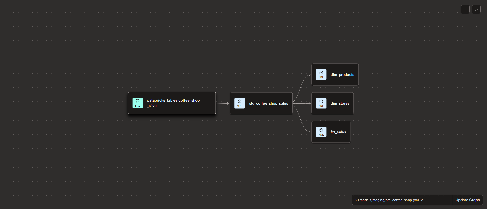
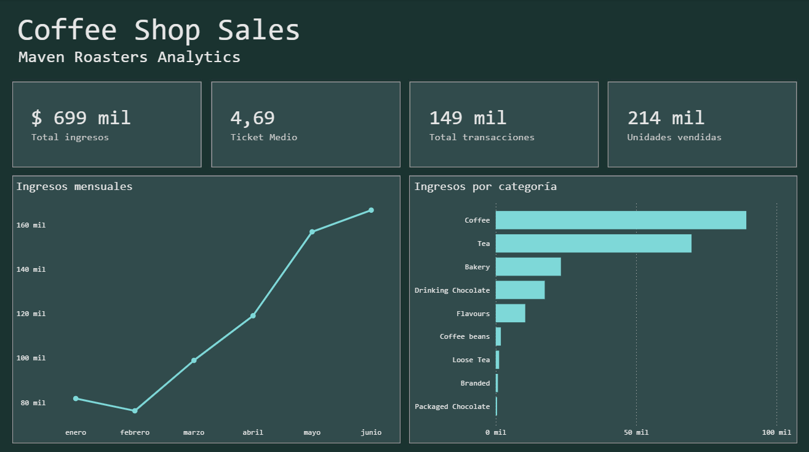
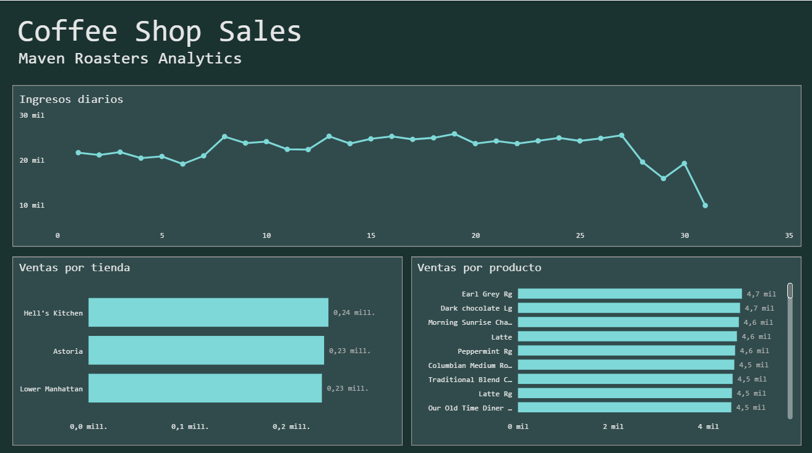

# Coffee Shop Sales: End-to-End Modern Data Lakehouse Pipeline

This repository contains a comprehensive, production-grade analytics engineering pipeline that processes raw transactional data from a coffee shop franchise, architecting it into a dimensional model, and visualizing business-critical performance metrics.

The project demonstrates how to orchestrate a modern data stack integration leveraging **Databricks** as the heavy processing engine, **dbt Cloud** for transformation, data quality testing, and lineage documentation, and a **Business Intelligence Layer** for executive reporting.

---

## 🏗️ Architecture & Data Flow

The pipeline is built following the principles of the **Lakehouse architecture** (Medallion pattern), ensuring logical separation of concerns, scalability, and strict data governance:

```
[Raw Excel/CSV Data] ──> [Databricks Bronze Layer] ──> [Databricks Silver Layer] 
                                                                 │
                                                                 ▼ (dbt Cloud Orchestration)
[Interactive BI Dashboard] <── [dbt Marts / Gold (Tables)] <── [dbt Staging (Logical Views)]
```

1. **Ingestion & Heavy ETL (Databricks - Bronze/Silver Layers):**
   * **Bronze Layer (`coffee_shop_raw`):** Handles append-only ingestion of raw transactional data.
   * **Silver Layer (`coffee_shop_silver`):** Cleanses data types, enforces naming schemas, eliminates duplicates, and prepares data for analytical consumption. Processes heavy compute utilizing Databricks Spark SQL.
2. **Data Modeling & Transformation (dbt Cloud - Gold Layer):**
   * **Staging Layer (`stg_coffee_shop_sales`):** Configured as a logical view acting as an isolated, single source of truth for downstream models.
   * **Marts Layer (Dimensional Star Schema):** Transformed into a classic dimensional model materialized as physical tables inside an isolated developer schema workspace to optimize BI query performance and lower data-scanning costs:
     * `dim_stores`: Contains unique branch locations and geographical metadata attributes.
     * `dim_products`: Holds the granular, deduplicated catalog of products categorized by type and detail.
     * `fct_sales`: Houses the numerical, quantitative transacted metrics linked exclusively back to dimensions via surrogate keys.
3. **Analytics & BI Visualization (Reporting Layer):**
   * Direct connection from a Serverless Databricks SQL Warehouse to ingest optimized Star Schema dimensional tables for low-latency visual analytics.

---

## 📐 Data Lineage (DAG)

The following Directed Acyclic Graph (DAG) represents the data lineage and dependencies managed entirely via dbt Cloud, showcasing the structured transition from raw source entities into robust analytics-ready tables:



---

## 🧪 Data Quality & Integrity Testing

To guarantee that business decisions are made based on reliable data, automated tests are implemented across the layers. The pipeline successfully executes and passes the following suites on every run:

* **Staging Quality Checks (`stg_coffee_shop_sales`):** Assures that the foundational primary key (`unique_row_id`) contains zero duplicates (`unique`) and zero empty records (`not_null`).
* **Marts Primary Key Validation:** Validates that `store_id` in `dim_stores`, `product_id` in `dim_products`, and `unique_row_id` in `fct_sales` remain fully unique and non-null identifiers.
* **Referential Integrity Testing:** Enforces database constraints at the software layer via `relationships` tests. It programmatically ensures that every single transactional `product_id` and `store_id` written into the `fct_sales` fact table exists beforehand in its matching dimension table, completely preventing orphaned records.

```bash
# Executing automated pipeline test suites
dbt test
# Status: Success 🎉
```

---

## 📊 Business Intelligence Dashboard

The resulting interactive dashboard translates data infrastructure into immediate corporate value, enabling executive decision-making.

### Page 1: Executive Sales Overview
*High-level strategic KPIs (Total Revenue, Average Ticket, Transaction Volumes), monthly growth patterns, and core product category revenue shares.*



### Page 2: Product & Location Deep Dive
*Daily operational revenue cycles, performance across geographic branches, and product-level velocity ranking.*



### 💡 Key Strategic Business Insights Discovered:
* **Explosive Mid-Year Growth:** The franchise experienced a strong upward revenue trajectory starting in March, peaking in June at over **$160k** in monthly sales.
* **Beverage Dominance:** *Coffee* and *Tea* constitute the overwhelming core of business revenue and transaction volume, indicating key operational focus areas.
* **Geographical Symmetry:** Revenue performance remains evenly distributed among main corporate branches (*Hell's Kitchen* leading slightly at **$0.24M**, followed closely by *Astoria* and *Lower Manhattan* at **$0.23M** each), proving stable demand across all territories.

---

## 🛠️ Tech Stack

* **Compute & Infrastructure:** Databricks (Serverless SQL Warehouse, Unity Catalog).
* **Data Transformation & Governance:** dbt Cloud (CLI, Jaffle Shop, Jinja templates).
* **Version Control:** Git & GitHub.
* **Reporting Layer:** Business Intelligence Tool.

---

## 📁 Repository Structure

```directory
├── models/
│   ├── staging/
│   │   ├── schema.yml                 # Source definitions, staging docs & quality tests
│   │   └── stg_coffee_shop_sales.sql   # Staging view layer
│   └── marts/
│       ├── schema.yml                 # Dimensional docs, primary key & relationship tests
│       ├── dim_products.sql            # Product dimension table
│       ├── dim_stores.sql              # Store dimension table
│       └── fct_sales.sql               # Sales fact table
├── images/
│   ├── dbt_lineage.png                # DAG lineage chart screenshot
│   ├── dashboard_page1.png            # BI Dashboard page 1 screenshot
│   └── dashboard_page2.png            # BI Dashboard page 2 screenshot
├── dbt_project.yml                     # General dbt configuration file
└── README.md                           # Comprehensive documentation
```

---

## 🚀 Deployment & Local Orchestration

1. Verify connection profiles and credentials point correctly to your active Databricks Serverless Warehouse cluster.
2. Install external package dependencies:
   ```bash
   dbt deps
   ```
3. Compile and execute SQL transformation models:
   ```bash
   dbt run
   ```
4. Perform the data quality and referential validation suites:
   ```bash
   dbt test
   ```